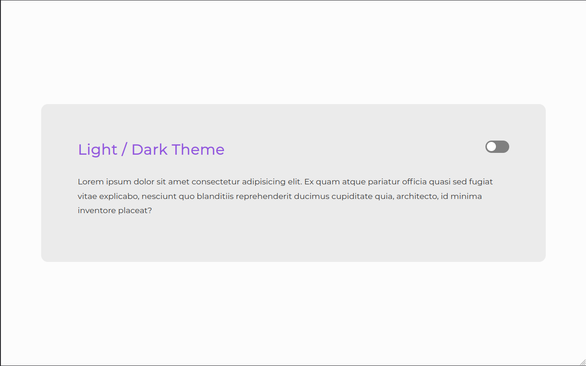
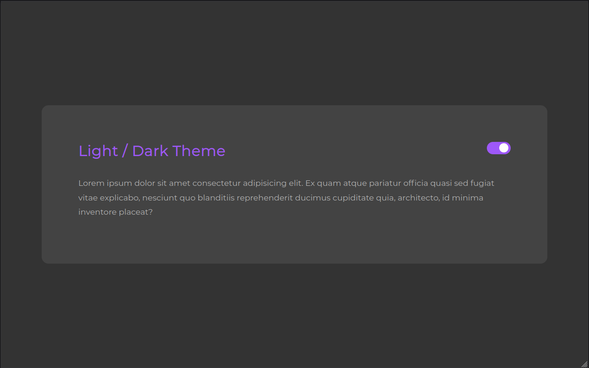

<h1 align="center" id="title">Light and Dark Mode Theme</h1>

<p align="center">A simple toggle theme mode using HTML, CSS and JavaScript!</p>

<br>

## Table of contents
<!--ts-->
   * [Overview](#overview)
   * [Technologies](#technologies)
   * [Getting the project](#getting-the-project)
   * [Viewing the Project](#viewing-the-project)
   * [Improvements and Suggested Ideas](#improvements-and-suggested-ideas)
   * [Author](#author)
<!--te-->

## Overview

Both the inspiration and the layout used in this project were based on the video [Creating a Dark & Light Toggle Mode on your UI Designs](https://www.youtube.com/watch?v=ZKXv_ZHQ654) from the [DesignCourse](https://www.youtube.com/channel/UCVyRiMvfUNMA1UPlDPzG5Ow) YouTube channel. However, applying a slightly different perspective on JavaScript, plus adding localStorage for theme persistence.

Go to the [top](#title).

## Technologies
The following technologies were used in the construction of the project:

- [JavaScript](https://developer.mozilla.org/pt-BR/docs/Web/JavaScript)
- [HTML](https://developer.mozilla.org/pt-BR/docs/Web/HTML)
- [CSS](https://developer.mozilla.org/pt-BR/docs/Web/CSS)

Go to the [top](#title).

## Getting the project

Open a command terminal in the folder where you want to save the project and type the command below:

```git
$ git clone https://github.com/jmontejr/light-dark-mode.git
```

Or download the compressed file directly from the project repository on Github and unzip wherever you want.

Go to the [top](#title).

## Viewing the Project

To view the project, simply access the [link](https://jmontejr.github.io/light-dark-mode) or once the project repository is cloned, go to the folder where the project is located and open the `index.html` file in your usual browser.

### 01- Light Mode
<p align="center">
    
</p>

### 02- Dark Mode
<p align="center">
    
</p>

Go to the [top](#title).


## Improvements and Suggested Ideas

### Improvements made:
- Adding localStorage to persist theme info;

### Suggested ideas:
- Adding CSS Preprocessors like Sass or Less.


Go to the [top](#title).

## Author

<h2>José Monte</h2>
<p>Development with :heart:</p>
<div>
    <a href="https://jmontejr.github.io">
        
    </a>
    <space></space>
    <a href="https://www.linkedin.com/in/jmontejr">
        
    </a>
    <space></space>
    <a href="https://codepen.io/jmontejr">
        
    </a>
</div>

Go to the [top](#title).
